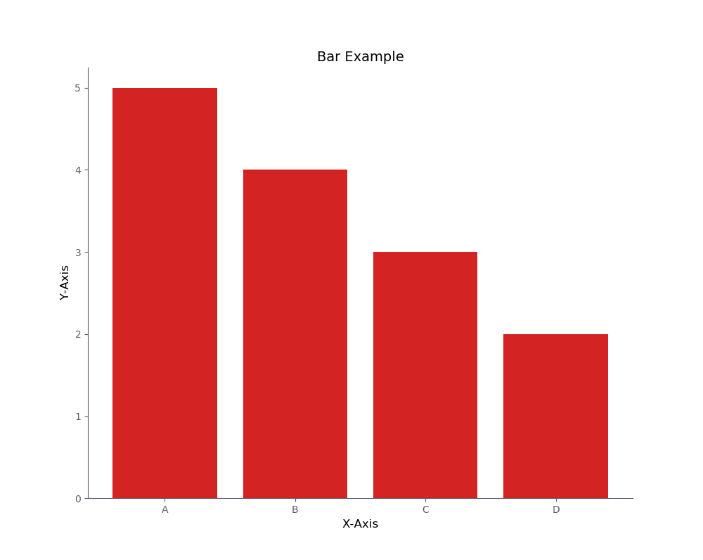

# Goza
A personal Python assistant library

## Overview
This is a working directory for Goza, my personal assistant Python library.  Goza provides me with tools to accomplish common tasks in my preferred manner.

## Installation
Goza is available on PyPI!

```python
pip install -U goza
```
## Modules
### Scatter Plot
`Scatter` creates a pre-formatted scatter plot.  Title, axis labels, and figure size may be passed as arguments.
#### Usage
```python
import random
from goza import Scatter

x = random.sample(range(1, 100), 50)
y = random.sample(range(1, 100), 50)

scatter = Scatter(x, y,  title="Scatter Example")
```


### Bar Plot
`Bar` creates a pre-formatted bar chart. Title, axis labels, figure size, and orientation may be passed as arguments.
```python
from goza import Bar

x = ["A", "B", "C", "D"]
y = [5, 4, 3, 2]

bar = Bar(x, y, title="Bar Example")
```



### ECDF Plot
`ECDF` creates a pre-formatted Empirical Cumulative Distribution Function (ECDF).  A single array is accepted to generate the plot. Title, axis labels, and figure size are accepted as arguments.

```python
from goza import ECDF
import numpy as np

x = np.random.normal(size=100)

ecdf = ECDF(x, title="ECDF Example")

```

